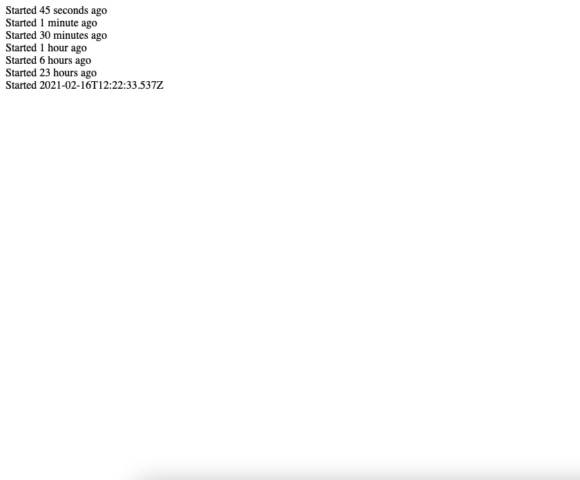
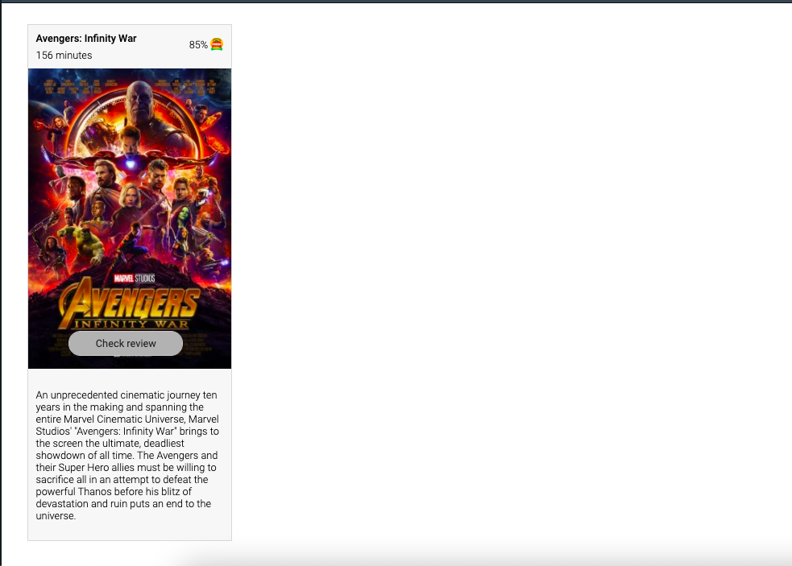

## Cache Enhancement Guildline

#### 1. We can you use Etag alongwith Redis

```php
function show()
{
    $id = $GET['id'] ?? return false;

    $cache = new Cache();
    $post = Request::get('https://jsonplaceholder.typicode.com/posts/'.$id);

    $etag = hash('sha256', sprintf('post-%s', $post->id));

    $cache->set($etag, $post);

    header('ETag:' . $etag);


    return json_encode($post);
}
```

### Development Instructions

Run PHP Development Sever

```
php -S localhost:8000
```

#### Note - Component style done in CSS / We may replace SCSS like preprocess.

# Test

Task 2:


Task 3:

